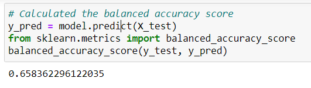
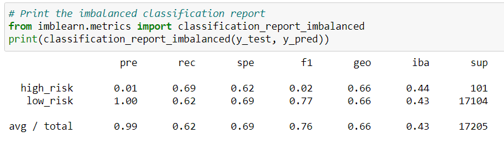
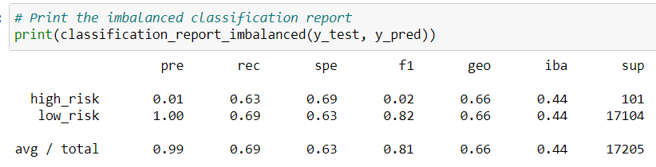
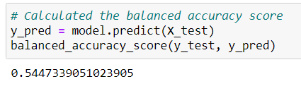
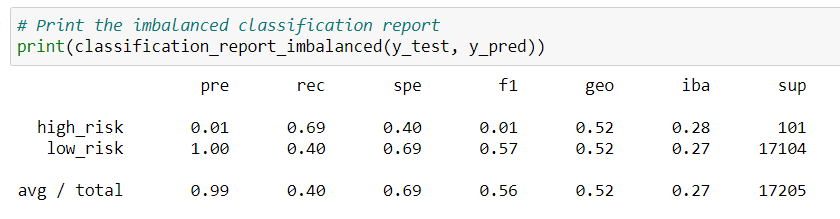
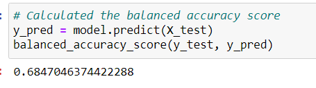
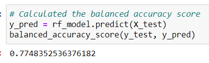
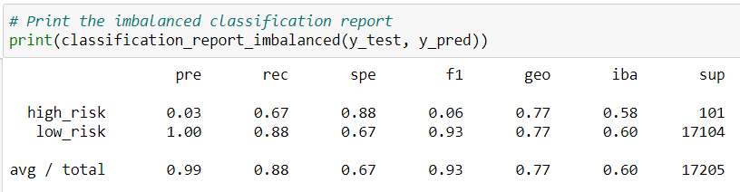
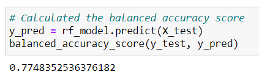
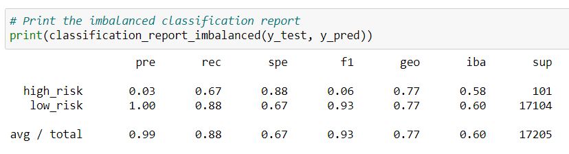

# Credit_Risk_Analysis

## Purpose
To use the below 6 machine learning models to evaluate credit risks for our customers with credit card credit dataset from LendingClub:
1. oversampling with **RandomOverSampler** and **SMOTE** algorithms
2. undersampliong with **ClusterCentroids** algorithm
3. over- and undersampling with SMOTEENN algorithm
4. compare two models to reduce bias with **BalancedRandomForestClassifier** and **EasyEnsembleClassifier**

## Results
### RandomOverSampler Model balanced accuracy score and imbalanced classification report

- Balance accuracy score rounded to the nearest percent is 66%.
- 
- 

### SMOTE Model balanced accuracy score and imbalanced classification report

- Balance accuracy score rounded to the nearest percent is 66%.
- 
- 

### ClusterCentroids Model balanced accuracy score and imbalanced classification report

- Balance accuracy score rounded to the nearest percent is 54%.
- 
- 

### SMOTEEN Model balanced accuracy score and imbalanced classification report

- Balance accuracy score rounded to the nearest percent  is 68%.
- 
- 

### BalancedRandomForestClassifierModel balanced accuracy score and imbalanced classification report

- Balance accuracy score rounded to the nearest percent  is 77%.
- 
- 

### EasyEnsembleClassifier Model balanced accuracy score and imbalanced classification report

- Balance accuracy score rounded to the nearest percent is 93%.
- 
- 
## Summary
