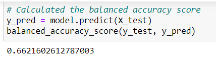
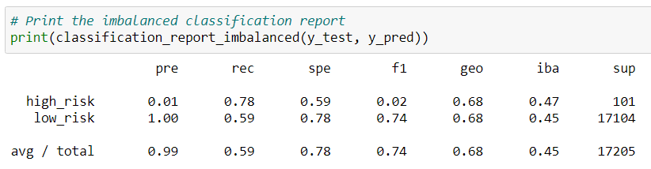
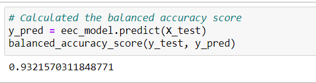
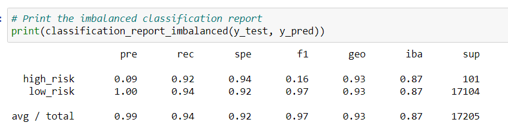

# Credit_Risk_Analysis

## Purpose
To use the below 6 machine learning models to evaluate credit risks for our customers with credit card credit dataset from LendingClub:
1. oversampling with **RandomOverSampler** and **SMOTE** algorithms
2. undersampliong with **ClusterCentroids** algorithm
3. over- and undersampling with SMOTEENN algorithm
4. compare two models to reduce bias with **BalancedRandomForestClassifier** and **EasyEnsembleClassifier**

## Results
### RandomOverSampler Model balanced accuracy score and imbalanced classification report

- Balance accuracy score rounded to the nearest percent is 66%.
- The high risk precision is at 1% and recall(sensitivity) score is 69% with a F-score of 2%.
- The low risk precision is at 100% and recall(sensitivity) score is 62% with a F-score of 77%.

### SMOTE Model balanced accuracy score and imbalanced classification report

- Balance accuracy score rounded to the nearest percent is close to the previous model at 66%.
- The high risk precision is at 1% and recall(sensitivity) score is 63% with a F-score of 2%.
- The low risk precision is at 100% and recall(sensitivity) score is 69% with a F-score of 82%.

### ClusterCentroids Model balanced accuracy score and imbalanced classification report

- Balance accuracy score rounded to the nearest percent is 54%%.
- The high risk precision is at 1% and recall(sensitivity) score is 78% with a F-score of 2%.
- The low risk precision is at 100% and recall(sensitivity) score is 40% with a F-score of 57%.

### SMOTEEN Model balanced accuracy score and imbalanced classification report

- Balance accuracy score rounded to the nearest percent  is 68%.
- The high risk precision is at 1% and recall(sensitivity) score is 69% with a F-score of 2%.
- The low risk precision is at 100% and recall(sensitivity) score is 59% with a F-score of 74%.

### BalancedRandomForestClassifierModel balanced accuracy score and imbalanced classification report

- Balance accuracy score rounded to the nearest percent  is 77%.
- The high risk precision is at 3% and recall(sensitivity) score is 67% with a F-score of 6%.
- The low risk precision is at 100% and recall(sensitivity) score is 88% with a F-score of 93%.

### EasyEnsembleClassifier Model balanced accuracy score and imbalanced classification report

- Balance accuracy score rounded to the nearest percent is 93%.
- The high risk precision is at 9% and recall(sensitivity) score is 92% with a F-score of 16%
- The low risk precision is at 100% and recall(sensitivity) score is 94% with a F-score of 97%.

## Summary
If we must pick one of the available models we used, the EasyEnsembleClassifer algorithms provides the highest sensitivity at 92% and highest precision at 9% along with the highest F-score of 16% for high risk predictions among all the other models. The calculated precision is really low to help LendingClub determine the credit risk decision. There will be many false positives for high risk customers even with our highest 9% precision. That is quite a lot of potential clients lost even if we use our best model. However, in conclusion, credit risks predictions are really difficult and I would not recommend any of the models we used to predict credit risks. 